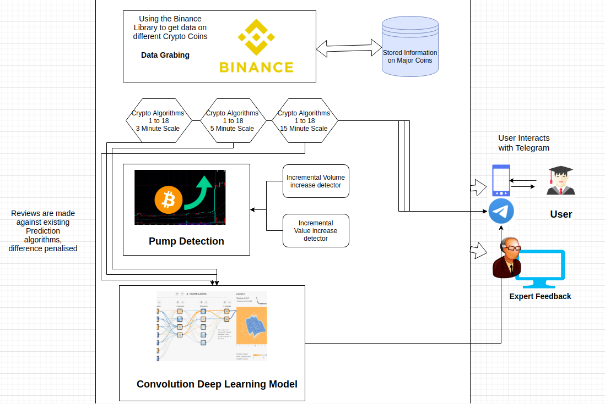

## Product Design

| Field          | Value                                                                 |
| -------------- | --------------------------------------------------------------------- |
| Project number | 13                                                                    |
| Project Title  | Algorithmic Trading                                                   |
| Document       | Product Design Document                                               |
| Creation date  | January 21, 2020                                                      |
| Created By     | Animesh Sinha, Bhuvanesh Sridharan, Gadela Kesav, L. Sai Tharun Reddy |
| Client         | Spinlogics                                                            |

## Design Overview

### Architectural design

+ The Segment of our analysis and code are relatively separate and functionally independent.
+  We shall develop the entire code on Python using the existing Rule based code.
+  Further adding in Python and developing Neural Nets in PyTorch / Tensorflow in R2.

---

####  The entire functionality of the system is broken down in the following sub-modules:
  + Script using Binance to continuosly fetch data and send to the main program.
  + Script using Ta-lib to calculate the parameters and make predictions using the predefined rules.
  + Script to properly format the raw data and their predictions appropriately and export them to a file.
  + Script containing code to visualise the above data and and quality of predictions and further using the Telegam API to send it to the end-user.

## System interfaces

### User Interface

There is no direct user interface, only a Telegram messaging bot which sends notifications with `/buy` or `/sell` tags as advice to the user. It attaches the rule that raised the flag and graphs for detail.

| Class       | Information                                                       |
| ----------- | ----------------------------------------------------------------- |
| DataGrabber | Keeps the data on CryptoCurrencies and their value history.       |
|             | Queries the binance data. Exposes get_price(date, coin) function  |
|             | to access price of coins. Caches data being saved to a local      |
|             | database                                                          |
| Messages    | Exposes the telegram message sending API via a wrapper.           |
|             | send_message(message, tag, image) will be the function to call,   |
|             | allows you to send graph as well.                                 |
| Predictors  | Classes that help predict the market going up or down.            |
|             | 1. Rule Based                                                     |
|             | 2. ML Model                                                       |
|             | 3. Pump Detect                                                    |
|             | All these have a predict function, they keep a DataGrabber object |
|             | and you get UP/DOWN as output                                     |
| Advisor     | Takes an array of predictors and a Messages client and gives      |
|             | `/buy` or `/sell` as output.                                      |

## Sequence Diagram(s)

## Design Rationale

The Project has been split into 3 ordered phases

1. Rule Based Algorithms - Comparison
2. Pump Detection by statiscal means
3. Machine Learning Models (Convolution Nets)

These 3 phases are ordered such because the results of one can feed features into the next stage of the pipeline.

+ Till now, no issues have arose in implementing this design and since the Client approves of this as well, we are continuing to exercise this plan.
---