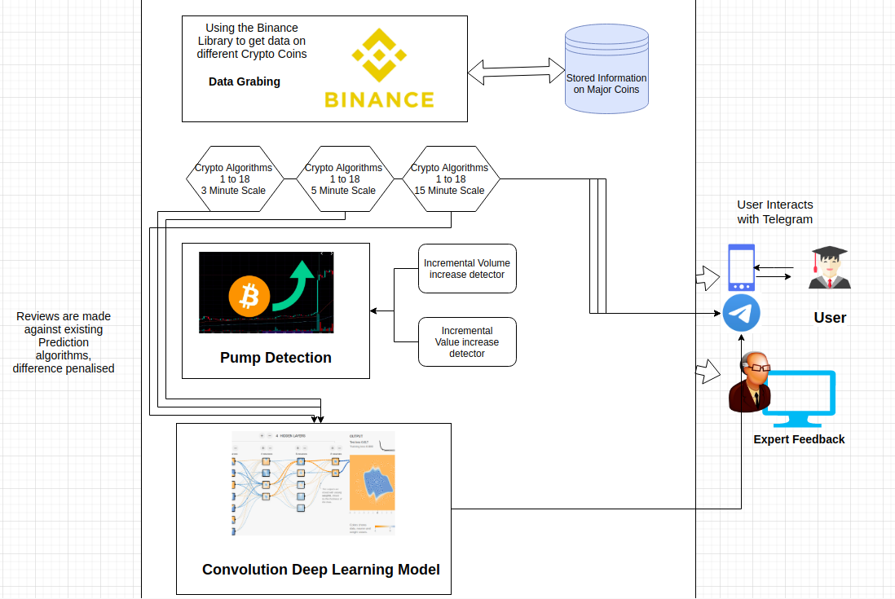

# System Requirements Specification

Project Title: Algorithmic Trading

Team Name: Dass Team 36

Team Members:

* Bhuvanesh Sridharan
* Animesh Sinha
* Kesav Gadela
* Sai Tharun Reddy

## Problem Statement

The Project is to compare and contrast existing Algorithms for CryptoCurrency trading and develop our own combinations. We are to follow it up with algorithms for Pump detection in coins. The final stage of the project will be to develop a Machine Learning Application that figures out combinations of these rules to maximize profits. We will Provide Telegram notifications to the users for the same.

## System Requirements

### IDE and Software Setup
* JetBrains Pycharm project
* GitLab for Version Control
* Python 3.7 with Conda and Pip

### Core Library Usage
* Binance (Fetching data on Cryptocurrencies)
* Thalib (For computing the average parameters and other indicators)
* Telegram API for making a Chatbot (BotFather group)

## User Profiles

* CryptoCurrency Traders: These are people who are somewhat familiar with finance and cryptocurrencies and are looking for algorithmic advice on when to buy and sell. No computational expertise is expected off them. They shall be sent Telegram Alerts only of when to buy and sell their coins.
* Algorithmic Experts: There is a debugging port to test the profits made and what rules and algorithms failed us when. These are people with both Computational and Financial expertise.

# Feature Requirements

## Comparisons of Existing Metrics
  * Obtaining the price of Cryptocurrency with time.
  * Running the Scripts over a span of 1-2 days and collecting data from the same.
  * Applying the 18 given metrics at 3, 5, 15 - minute and marking purchase/sell times.
  * Running the above for combination times and contrasting the results.
  * Reporting the profits by each of the 18 algorithms on 6 time-combos.
  * Preparing a MS Excel as an output for the above.
  * Analysing the effect of cost of BitCoin in USD on the performance on these algorithms.
  * Plotting profit chart of each algo against BitCoin-USD Exchange rate.
  * The CSV file should have 6 columns (Coin Name, Purchase Time, Purchase Value, Sell Time, Sell Value, Profit/Loss)

## Pump Detection
  * Reading up on the nature of Pump detection.
  * Evaluation of pump based on the volume and price of coins.
  * Marking common times of pump in the coins.
  * Devicing Algorithms to predict pump.
  * Comparing our alert system with existing telegram groups.

## Development of ML Algorithm
  * Analyzing Hard-Coded Features from the 18*6 Metrics we have.
  * Decide on other features that the ML Model is to be trained on.
  * Builing a Convolutional Neural Net to analyze structure in the data.
  * Ensure that we make steady profits every day averaged over the week.
  * Contrast the performance of this model against rule based and ensure it's better.
  * Attempt the Binance interface can be done through WebSockets to increase API limits.
  * Keep a cache and not requery the Binance API.

## User Interface End
  * There Should be a Telegram group with a ChatBot.
  * The ChatBot should send text of when to /buy and /sell.
  * There should be added reasoning and graphs with the message.
  * The script should be runnable on an online deployed platform.

Since there is no good way to measure the accuracy of these algorithms, we shall attempt our best to make small profits on the run, there is no objective committed scale of measure. There is also no scaling and Deployment speed contraint.

# Use Case List

| No. | Use Case                     | Description                                                                                             | Release |
| --- | ---------------------------- | ------------------------------------------------------------------------------------------------------- | ------- |
| 1.  | Market Status Review         | The user wants to know if the market is going up or down. It's better to when the market is on the rist | R1      |
| 2.  | Get CryptoCurrency Price     | The user may want to get automated list of costs of all major coins on our list.                        | R1      |
| 3.  | Help in Decision Making      | User who is new to trading may want advice from algorithms on which coins to buy.                       | R1      |
| 4.  | Automated Money Farm         | A Superior algorithm running by itself should be able to keep producing profits.                        | R2      |
| 5.  | Compare Market Indicators    | Useful in seeing which indicators are more important to predicting prices.                              | R1      |
| 6.  | US Dollar Effects            | To see what the effects of the real world Currencies have on the Crypto coins.                          | R1      |
| 7.  | Compare Coins                | See which new Crypto coins are good for investments.                                                    | R1      |
| 8.  | Save User Time               | The User can filter good investments and choose amongst them when investing.                            | R1      |
| 9.  | Detect Pump in Market        | Detect that someone is artificially buying a lot of stocks to dump them later.                          | R2      |
| 10. | Avoid Purchase during Pump   | Stop Purchases and Sell stocks where pump is deteced.                                                   | R2      |
| 11. | Alert about Sudden Losses    | Alert the user that there can be a sudden market collapse and he should immediately tend to it.         | R2      |
| 12. | Analyse artificial inflation | Analyse the patters that people use to inflate the value of coins                                       | R2      |

# Use Case Diagrams

# Use Case Explanations

| Topic            | Value                                                                                                    |
| ---------------- | -------------------------------------------------------------------------------------------------------- |
| Use Case Number: | 1                                                                                                        |
| Use Case Name:   | Market Status Review                                                                                     |
| Overview:        | The user wants to know if the market is going up or down. It's better to when the market is on the rise. |
| Actors:          | Open Market, Crypto Trader (Novice)                                                                      |
| Precondition:    | The user wants to determine if it's a good time in the crypto market.                                    |
| Flow:            | The algorithms takes a look at the net expected profits using it's own decisions.                        |
| Postcondition:   | App advises user to try if it's able to make profits (market going up).                                  |

| Topic            | Value                                                                            |
| ---------------- | -------------------------------------------------------------------------------- |
| Use Case Number: | 2                                                                                |
| Use Case Name:   | Get Cryptocurrency Price                                                         |
| Overview:        | The user may want to get automated list of costs of all major coins on our list. |
| Actors:          | Market Analyst, Crypto Trader                                                    |
| Precondition:    | User tries to get the list of prices of all major coins.                         |
| Flow:            | App is consistently fetching and keeping history on all coins using binance.     |
| Postcondition:   | The user is returned a list of prices of all major coins.                        |

| Topic            | Value                                                                             |
| ---------------- | --------------------------------------------------------------------------------- |
| Use Case Number: | 3                                                                                 |
| Use Case Name:   | Help in Decision Making                                                           |
| Overview:        | User who is new to trading may want advice from algorithms on which coins to buy. |
| Actors:          | Novice Crypto Trader, Algorithmic Bot                                             |
| Precondition:    | The user wants to invest in crypto but has no idea what stocks to buy.            |
| Flow:            | The telegram bot keeps advising with /buy and /sell directives.                   |
| Postcondition:   | The user is able to follow the advise and make a decent profit.                   |

| Topic            | Value                                                                            |
| ---------------- | -------------------------------------------------------------------------------- |
| Use Case Number: | 4                                                                                |
| Use Case Name:   | Automated Money Farm                                                             |
| Overview:        | A Superior algorithm running by itself should be able to keep producing profits. |
| Actors:          | Algorithmic Bot, Novice Crypto Trader.                                           |
| Precondition:    | The user just wants to invest money and keep the bot running.                    |
| Flow:            | The algorithm keeps requesting /buy and /sell.                                   |
| Postcondition:   | The algorithms manages to make the user some profits.                            |

| Topic            | Value                                                                               |
| ---------------- | ----------------------------------------------------------------------------------- |
| Use Case Number: | 5                                                                                   |
| Use Case Name:   | Compare Market Indicators                                                           |
| Overview:        | Useful in seeing which indicators are more important to predicting prices.          |
| Actors:          | Algorithmic Analyst, Market Analyst                                                 |
| Precondition:    | Analysts want to see which rules perform better on average.                         |
| Flow:            | The experts let the neural nets learn the weights improving quality of performance. |
| Postcondition:   | The analysts get more combination rules and determine relative importance.          |

| Topic            | Value                                                                                             |
| ---------------- | ------------------------------------------------------------------------------------------------- |
| Use Case Number: | 6                                                                                                 |
| Use Case Name:   | US Dollar Effects                                                                                 |
| Overview:        | To see what the effects of the real world Currencies have on the Crypto coins.                    |
| Actors:          | Algorithmic Analyst, Market Analyst                                                               |
| Precondition:    | Experts want to see the effect of the real world US Dollar market on the crypto market.           |
| Flow:            | The relevance of rules is evaluated and presented against rise/fall of the USD vs. Bitcoin price. |
| Postcondition:   | A graph of rule relevance against USD vs. Bitcoin price is plotted for all rules.                 |

| Topic            | Value                                                                                       |
| ---------------- | ------------------------------------------------------------------------------------------- |
| Use Case Number: | 7                                                                                           |
| Use Case Name:   | Compare Coins                                                                               |
| Overview:        | The User can filter good investments and choose amongst them when investing.                |
| Actors:          | Algorithmic Analyst, Market Analyst, Crypto Traders, New CryptoCurrencies                   |
| Precondition:    | User wants to see which small cryptocurrencies are worth investing.                         |
| Flow:            | The patterns to price variation are analysed by neural nets to get the quality of purchase. |
| Postcondition:   | The best coins to buy for immediate profit are enlisted.                                    |

| Topic            | Value                                                                                       |
| ---------------- | ------------------------------------------------------------------------------------------- |
| Use Case Number: | 8                                                                                           |
| Use Case Name:   | Save User Time                                                                              |
| Overview:        | The User can filter good investments and choose amongst them when investing.                |
| Actors:          | Crypto Traders.                                                                             |
| Precondition:    | The user wants to invest but has too many choices, he wants to filter out the bad ones.     |
| Flow:            | The list of cryptocoins should be filtered to ones where larger profits are to be expected. |
| Postcondition:   | The should keep getting all choices which will make steady profits.                         |

| Topic            | Value                                                                                      |
| ---------------- | ------------------------------------------------------------------------------------------ |
| Use Case Number: | 9                                                                                          |
| Use Case Name:   | Detect Pump in Market                                                                      |
| Overview:        | Detect that someone is artificially buying a lot of stocks to dump them later.             |
| Actors:          | Algorithmic Analyst, Crypto Trader, Pump Creator                                           |
| Precondition:    | The volume and price of coins is increasing.                                               |
| Flow:            | The algorithms notices and flags this alert.                                               |
| Postcondition:   | The coin gets dumped and we see the alerts on cryptocurrency telegram groups for the same. |

| Topic            | Value                                                                                        |
| ---------------- | -------------------------------------------------------------------------------------------- |
| Use Case Number: | 10                                                                                           |
| Use Case Name:   | Avoid Purchase during Pump                                                                   |
| Overview:        | Stop Purchases and Sell stocks where pump is deteced.                                        |
| Actors:          | Crypto Traders, Pump Creator                                                                 |
| Precondition:    | A pump is detected in the market, and there is a lot of stock in that currency for the user. |
| Flow:            | As the price drops the user should keep selling his stocks (or keep getting messages to).    |
| Postcondition:   | The price drop should happen but the user should have sold his stocks by then.               |

| Topic            | Value                                                                                           |
| ---------------- | ----------------------------------------------------------------------------------------------- |
| Use Case Number: | 11                                                                                              |
| Use Case Name:   | Alert about Sudden Losses                                                                       |
| Overview:        | Alert the user that there can be a sudden market collapse and he should immediately tend to it. |
| Actors:          | Crypto Trader, Open Market                                                                      |
| Precondition:    | The user has a lot of the same crypto coin purchased and it's price is falling.                 |
| Flow:            | The predictor should alert the user that helps him withdraw his stocks.                         |
| Postcondition:   | The price of stock should keep falling off stadily if the prediction was correct.               |

| Topic            | Value                                                                              |
| ---------------- | ---------------------------------------------------------------------------------- |
| Use Case Number: | 12                                                                                 |
| Use Case Name:   | Analyse artificial inflation                                                       |
| Overview:        | Analyse the patters that people use to inflate the value of coins                  |
| Actors:          | Market Analyst, Pump Creator                                                       |
| Precondition:    | The pump creator is stadily buing stocks increasing his volume and price of stock. |
| Flow:            | The predictor should alert the user that helps him withdraw his stocks.            |
| Postcondition:   | The price of stock should start falling off quickly.                               |

